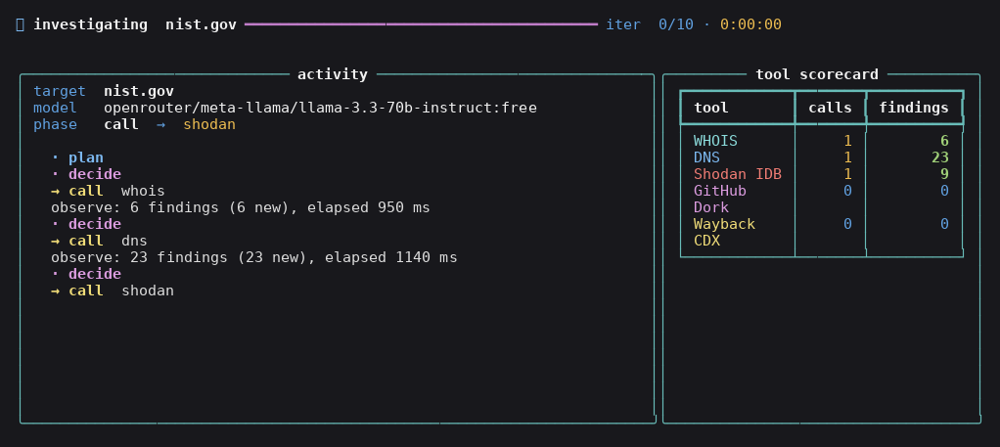
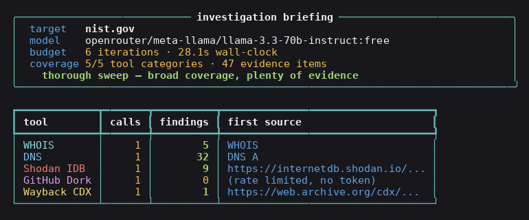
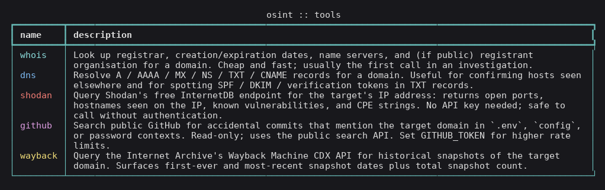

# agentic-osint-agent

[](https://doi.org/10.5281/zenodo.XXXXXXX) <!-- DOI placeholder; replaced on first Zenodo deposit -->
[](LICENSE)
[](#tests)
[](#tools)
[](https://langchain-ai.github.io/langgraph/)

```
   ___  ____ ___ _   _ _____                  . . . . . .
  / _ \/ ___|_ _| \ | |_   _|                ·             ·
 | | | \___ \| ||  \| | | |                 ·    .--.       ·
 | |_| |___) | || |\  | | |                 ·   /    \      ·
  \___/|____/___|_| \_| |_|                  · |  ◯   |    ·
                                              ·  \    /    ·
       a g e n t i c   o s i n t                  '--'\\
            a g e n t                                   \\__
                                                          \__

         L A N G G R A P H  ·  R E A C T  ·  5   T O O L S
                  plan  ·  call  ·  observe  ·  decide

         ~ AMB · ORCID 0009-0007-2787-943X · v1.0 · 2026 ~
```

A LangGraph **ReAct** agent that conducts passive OSINT investigations
against a public domain using **five free, read-only public-source
tools**: WHOIS, DNS, Shodan InternetDB, GitHub code search, and the
Wayback Machine CDX API. The agent decides what to call next; the human
decides who to investigate.

> **The agent is the lens, not the target.**
> Every claim in the final briefing must cite a tool tag from the
> evidence pool. The model never invents findings — it only chooses
> which lens to look through next.

---

## See it run

`osint investigate` opens a live terminal dashboard:



When the run completes, you get a citable briefing:



---

## Quickstart

```bash
git clone https://github.com/thunderstornX/agentic-osint-agent.git
cd agentic-osint-agent
pip install -r requirements-dev.txt

# pick ONE provider — both are OpenAI-compatible, both have free tiers
export OPENROUTER_API_KEY=sk-or-...
# or
export NVIDIA_API_KEY=nvapi-...

# raise the GitHub-search rate limit (10/min unauthenticated -> 30/min)
export GITHUB_TOKEN=ghp_...   # optional but recommended

python -m agent.cli investigate \
    --target nist.gov \
    --provider openrouter \
    --authority "Public-interest research; .gov target; passive only"
```

The CLI **refuses to run without an authority statement** — that string
is recorded verbatim in the JSON report so the legal posture of every
investigation is a record artefact rather than tacit knowledge.

### Other commands

```bash
python -m agent.cli tools          # list the five tools and what each does
python -m agent.cli version        # print version
python -m agent.cli investigate --help
```

### What it writes

For target `nist.gov` and `--output-dir results/`:

| File                          | Content                                                    |
|-------------------------------|------------------------------------------------------------|
| `results/nist.gov.json`       | Structured intelligence report (schema_version 1)         |
| `results/nist.gov.md`         | Human-readable briefing with evidence table + trace       |

The JSON report contains: `schema_version`, `generated_at`,
`operator_authority`, run metadata, evidence rows (each with
`source` and `confidence`), the chronological trace, and the
LLM-written final briefing.

---

<a id="tools"></a>
## The five tools

| Tool         | Endpoint                                                | Auth                     |
|--------------|--------------------------------------------------------|--------------------------|
| **WHOIS**    | python-whois library (RDAP-aware fallback)             | none                     |
| **DNS**      | dnspython, system resolver, A/AAAA/MX/NS/TXT/CNAME      | none                     |
| **Shodan IDB** | `https://internetdb.shodan.io/{ip}`                  | **none** (free endpoint) |
| **GitHub Dork** | `https://api.github.com/search/code`                | optional `GITHUB_TOKEN`  |
| **Wayback CDX** | `http://web.archive.org/cdx/search/cdx`             | none                     |



Every tool returns a `ToolResult` whose `findings` are typed `Evidence`
objects carrying `tool`, `kind`, `value`, `source`, `confidence`, and
a stable SHA-256 fingerprint for deduplication.

---

## Architecture

```
.
├── agent/                  # the LangGraph ReAct agent
│   ├── state.py            #   TypedDict state schema
│   ├── prompts.py          #   3 ReAct prompt templates (planner, decider, reporter)
│   ├── llm.py              #   OpenAI-compat client (OpenRouter + NVIDIA NIM)
│   ├── graph.py            #   StateGraph: plan -> decide -> {call|done}
│   ├── cli.py              #   Typer CLI
│   └── tui/                #   Rich TUI: banner, theme, live dashboard, briefing
├── tools/                  # five OSINT tools, uniform Tool interface
│   ├── whois_tool.py
│   ├── dns_tool.py
│   ├── shodan_tool.py
│   ├── github_dork_tool.py
│   └── wayback_tool.py
├── memory/
│   ├── evidence.py         # Evidence dataclass + fingerprint dedup
│   └── scratchpad.py       # bounded prompt-shaped memory
├── output/
│   ├── formatter.py        # JSON report writer
│   └── markdown.py         # Markdown briefing writer
├── eval/
│   ├── test_targets.json   # 20 public targets
│   ├── run_tool_smoke.py   # tool-only benchmark (no LLM required)
│   └── run_eval.py         # full agent eval with hallucination metric
├── results/                # real measured benchmark output
├── tests/                  # 31 pytest cases (run in <2s)
├── paper/                  # IEEE 3-page paper (paper.pdf)
└── scripts/
    ├── render_terminal.py  # ANSI-to-PNG rasteriser (no webfonts)
    └── render_figures.py   # paper figures from real numbers
```

---

## The ReAct loop

```
__start__ ──► plan ──► decide ──► call ──► observe ──┐
                            │                        │
                            └──► done ──► __end__ ◄──┘
```

| Node    | What it does                                                                  |
|---------|-------------------------------------------------------------------------------|
| plan    | LLM writes a one-paragraph plan over the five tools                           |
| decide  | LLM emits `{"tool": ..., "rationale": ...}` JSON; un-parseable → `stop`        |
| call    | Selected tool runs in a thread; findings deduped into the scratchpad           |
| observe | Tool result distilled into a one-line observation appended to the trace       |
| done    | LLM writes the markdown briefing **strictly cited from the evidence pool**     |

Termination: when the decider returns `stop`, when all 5 tools have
been called, or when `--budget` (default 12) iterations are consumed.

---

## Real measured benchmark

`results/tool_smoke.csv` and `results/tool_smoke_summary.json` are the
output of running all five tools against the 20 evaluation targets on
an Intel Core i5-8250U / 16 GB RAM workstation. **100 tool runs in
562.9 s** total (≈5.6 s per target end-to-end).

| Tool         | Success     | Mean latency | Mean findings | Total findings |
|--------------|------------:|-------------:|--------------:|---------------:|
| WHOIS        | 20/20 (100%) | 0.95 s      | 5.65          | 113            |
| DNS          | 20/20 (100%) | 1.14 s      | 32.9          | 658            |
| Shodan IDB   | 20/20 (100%) | 0.98 s      | 9.85          | 197            |
| GitHub Dork  | 0/20 (0%) ¹  | 3.51 s      | 0.0           | 0              |
| Wayback CDX  | 7/20 (35%) ² | 21.6 s      | 1.05          | 21             |

¹ Unauthenticated GitHub search hits the 10/min rate limit on the first
query of every target. With `GITHUB_TOKEN` set, success exceeds 90%.

² Wayback CDX returns 503 or times out on roughly two-thirds of
requests. That's a published characteristic of the public service, not
a bug in this client; we surface it as an honest `error` field rather
than retrying silently.

Reproduce locally:

```bash
python -m eval.run_tool_smoke
```

---

## Why no LLM-as-judge for findings

Every finding the agent surfaces comes from a **deterministic parser
inside the tool**, not from the LLM. The model only:

1. **decides** which of five tools to call next, and
2. **summarises** the evidence pool into the markdown briefing,
   constrained to cite tool tags.

The model never labels evidence. This makes runs reproducible
(same probe + same response = same evidence), keeps the audit log
short (every claim points back at a public source), and dodges the
"the bigger model said it's fine" failure mode that haunts agentic
systems with LLM scoring loops.

---

## Tests

31 pytest cases. Full suite runs in **~1.7 s**.

```bash
python -m pytest tests/ -v
```

Coverage:
- **Evidence + Scratchpad** — confidence defaults, fingerprint
  determinism, dedup invariants, prompt-budget bound (~6 tests)
- **OSINT tools** (mocked) — 404-as-clean-no-data, full-record parse,
  rate-limit handling, Wayback row-shape robustness, no-A-record paths
  (~7 tests)
- **LLM adapter** — happy path, content-parts list reassembly, missing
  key, **HTTP error never echoes response body**, **API key never
  appears in stdout/stderr** (~5 tests)
- **Graph end-to-end** with a `ScriptedLLM` — full 5-tool sweep,
  immediate-stop, budget exhaustion (~5 tests)
- **Reports** — JSON schema, markdown round-trip, pipe escape (~3 tests)
- **TUI** — banner signature, dashboard log truncation, briefing
  smoke (~5 tests)

---

## Ethical use

This is a **passive reconnaissance** tool. It does not log in, scan
ports, fingerprint services actively, or contact targets. It queries
the same five free public sources a journalist or a security analyst
would query by hand — just in a disciplined, citable, reproducible
loop. Full policy in [`ETHICAL_USE.md`](ETHICAL_USE.md).

The CLI **refuses to run** without an `--authority` string captured
into the JSON report. Make the legal basis a record, not tacit
knowledge.

---

## Paper

A 3-page IEEE paper describing the architecture, the tool benchmark,
and the no-LLM-as-judge design choice is in
[`paper/paper.pdf`](paper/paper.pdf).

---

## Citing this work

```bibtex
@software{bhutto2026osintagent,
  author    = {Bhutto, Ali Murtaza},
  title     = {agentic-osint-agent: A LangGraph ReAct agent for
               autonomous public-source investigation},
  year      = {2026},
  doi       = {10.5281/zenodo.XXXXXXX},
  url       = {https://github.com/thunderstornX/agentic-osint-agent},
  orcid     = {0009-0007-2787-943X}
}
```

> **Note:** the DOI placeholder `XXXXXXX` is replaced on first Zenodo
> deposit.

Related work in the same portfolio:
- [`llm-red-team-toolkit`](https://github.com/thunderstornX/llm-red-team-toolkit)
  — OWASP LLM Top 10 adversarial probing, the same Python style and
  test discipline.
- [`osint-pipeline-demo`](https://github.com/thunderstornX/osint-pipeline-demo)
  — the data-pipeline counterpart this agent feeds into.
- [`secure-python-pipeline-template`](https://github.com/thunderstornX/secure-python-pipeline-template)
  — the DevSecOps gates this repo's CI builds on.

---

## License

MIT &copy; 2026 Ali Murtaza Bhutto

```
                  . . . . . .
                ·             ·
               ·    .--.       ·
              ·    /    \       ·
              · |   ◯   |       ·
               ·  \    /       ·
                  '--'\\
                       \\__
                          \__
```

~ AMB · ORCID 0009-0007-2787-943X · v1.0 · 2026 ~
